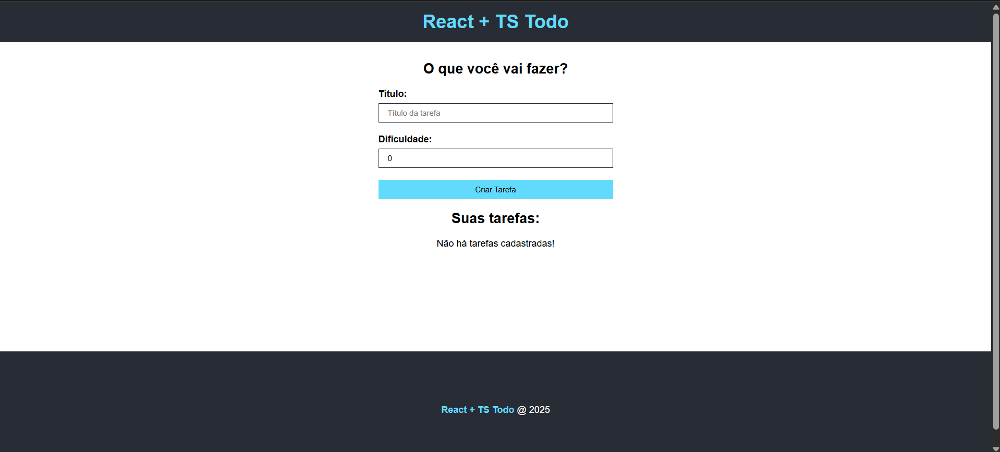

# ✅ Todo list React com Typescript

Este projeto é uma aplicação simples de lista de tarefas (Todo List), desenvolvida com o objetivo de praticar conceitos fundamentais do React com TypeScript, organização de componentes e manipulação de estados.

---

## 🎯 Objetivo

Desenvolver uma aplicação funcional de gerenciamento de tarefas que permita:

✅ Adicionar novas tarefas

📝 Editar tarefas existentes

🗑️ Remover tarefas

Com isso, o projeto tem como foco:

Praticar e fixar o uso de React com TypeScript

Organizar componentes de forma escalável

Trabalhar com hooks, como useState e useEffect

---

## 🧪 Tecnologias Utilizadas

- **⚛️ React**

- **⛓️ TypeScript**

## 🧠 Aprendizados

Durante o desenvolvimento, foram reforçados os seguintes pontos:

Utilização de tipos personalizados com TypeScript

Criação de componentes reutilizáveis

Gerenciamento de estado local com React

Boas práticas de organização de código

Aplicação de estilos de forma limpa e responsiva

---

## 📸 Prévia do Projeto
